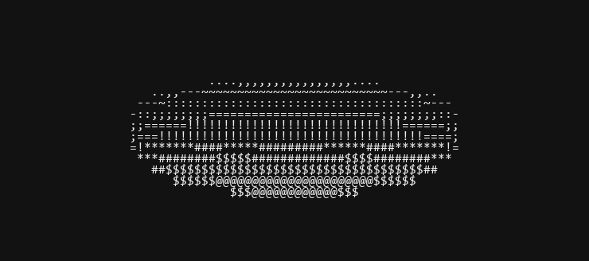

# Spinning 3D ASCII Torus (donut.c) in Multiple Languages



This repository contains clean, modern, and heavily-commented implementations of Andy Sloane's famous 2006 **donut.c** (the spinning 3D ASCII torus) across multiple programming languages.

Instead of the original obfuscated shape, these implementations prioritize clean code structure, readability, and performance while retaining the exact core mathematical algorithms (torus equations, 3D rotations, perspective projection, Z-buffering depth resolution, and surface normal luminance shading).

---

## 🚀 How to Run the Implementations

### 1. Python
Uses standard libraries and standard console printing to render a smooth frame rate of ~30 FPS.
```bash
python donut.py
```
- **File**: [`donut.py`](file:///c:/Users/matmu/main-git/donut/donut.c/donut.py)
- **Requirements**: Python 3.x (Standard library only)

### 2. JavaScript / Node.js
Uses Node.js standard process buffers and ANSI terminal escapes.
```bash
node donut.js
```
- **File**: [`donut.js`](file:///c:/Users/matmu/main-git/donut/donut.c/donut.js)
- **Requirements**: Node.js

### 3. Rust
An extremely performant and safe implementation using Rust's `BufWriter` for high-throughput console I/O.
```bash
rustc donut.rs
./donut
```
- **File**: [`donut.rs`](file:///c:/Users/matmu/main-git/donut/donut.c/donut.rs)
- **Requirements**: Rust Compiler (`rustc`)

---

## 🧮 How the Mathematics Works

The math behind rendering a 3D torus onto a 2D ASCII screen operates in four main steps:

### 1. Torus Geometry
We generate points on the surface of a torus by taking a circle of radius $R_1$ centered at $(R_2, 0, 0)$ and rotating it around the Y-axis. 
* $\theta$ (theta) sweeps the circle's cross-section.
* $\phi$ (phi) sweeps the circle around the center of the torus.

$$
\begin{aligned}
x_{circle} &= R_2 + R_1 \cos\theta \\
y_{circle} &= R_1 \sin\theta
\end{aligned}
$$

### 2. 3D Rotation Matrix
To rotate the torus in 3D space over time, we rotate the coordinates by angle $A$ (around the X-axis) and angle $B$ (around the Z-axis):

$$
\begin{aligned}
x &= x_{circle} (\cos B \cos\phi + \sin A \sin B \sin\phi) - y_{circle} \cos A \sin B \\
y &= x_{circle} (\sin B \cos\phi - \sin A \cos B \sin\phi) + y_{circle} \cos A \cos B \\
z &= K_2 + \cos A x_{circle} \sin\phi + y_{circle} \sin A
\end{aligned}
$$

### 3. Perspective Projection & Depth buffering (Z-buffer)
To map the 3D coordinates $(x, y, z)$ to a 2D grid $(x_{proj}, y_{proj})$, we compute the depth inverse $ooz = 1/z$. Points further away project closer to the center, while points closer project outward. We keep a `z_buf` depth map to ensure that closer points override further ones.

### 4. Shading and Luminance
We calculate the surface normal at each point and take its dot product with a light source vector (shining from $(0, 1, -1)$). The resulting luminance $L$ determines the brightness character from the ramp:

`.,-~:;=!*#$@`
